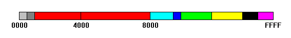
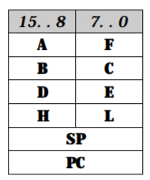
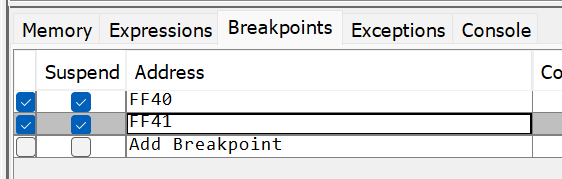

# How to convert Game Boy ROMs to Analogue Pocket homebrew

This tutorial is a work in progress. Corrections and requests for clarification appreciated.

Additionally, this document comes with a humble disclaimer: I have no idea what I'm doing.


## What is this?
The [Analogue Pocket](https://www.analogue.co/pocket) allows you to play homebrew Game Boy and Game Boy Color games created with [GB Studio](https://www.gbstudio.dev/).

The differences between GB Studio games as compiled for Pocket and retail games are fairly minimal. These differences can be patched on a per-game basis to enable playing directly from an SD card without a cartridge.

Until a jailbreak is released, a small group of people have taken on the task of converting retail games to Pocket format. This guide intends to help you get started patching if that sort of thing interests you.

Besides the convenience of playing the games without a cartridge, patching is a fun puzzle to work out, and the feeling you get having successfully converted a game you love and ironing out glitches is immensely satisfying.

Special thanks to [Analogue](https://www.analogue.co/), [BestPig](https://twitter.com/bestpig), [JoseJX], [infinest](https://github.com/jduckett95), [jimmyduckegg](https://twitter.com/Pocket_Patches), and big ups to everyone working on patches.


## FAQ

### Q: Can you patch Game Boy Advance games?
A: No, GB Studio can only create GB and GBC games, so that's all the Pocket was designed to play from SD.

### Q: Can all games be patched?
A: Broadly speaking, yes, but some games are way more complicated to patch than others depending on how they utilize the affected registers. Games also increase in complexity the larger they are, and GBC games are usually more difficult than GB games.

### Q: Will you please patch my favorite game?
A: Maybe, fill out [this form](https://docs.google.com/forms/d/e/1FAIpQLSeqEnkT_ZebRavAPEUZd53PuGJCzYRssvwaGRoY7naucPtRyg/viewform) and we'll get to it when we can and if it's possible.


## The Gist
- Decompile the ROM
- Make necessary edits
    - Move [`LCDC`] register calls from `$ff40` to `$ff4e`
    - Bit reverse reads/writes to [`LCDC`] and [`STAT`]
    - Replace the logo in the header
- Compile ROM and fix checksums
- Testing & debugging
- Create IPS patch

[`LCDC`]: https://gbdev.io/pandocs/LCDC.html
[`STAT`]: https://gbdev.io/pandocs/STAT.html


## Recommended software
- [mgbdis]: A Game Boy ROM disassembler
- [rgbds]: A Game Boy compiler
- [Visual Studio Code](https://code.visualstudio.com/) or an IDE with nice diff features
- [`make`](https://www.gnu.org/software/make) (`mgbdis` produces a `Makefile` that `rgbds` uses to compile)
  - I use `make` from [WSL2 Ubuntu](https://ubuntu.com/wsl) in Windows, but you can use it directly in Windows via [GnuWin32](http://gnuwin32.sourceforge.net/), [MSYS2](https://www.msys2.org/), [CYGWIN](https://www.cygwin.com/), etc.
- [Emulicious] and/or [JoseJX]'s patched [SameBoy Pocket](https://github.com/JoseJX/SameBoy) for testing & debugging
  - A Windows build of SameBoy Pocket is available here: [SameBoy Pocket (Windows)-6f8c35c.zip]
- [LunarIPS](https://www.romhacking.net/utilities/240/) or another IPS (binary) tool that supports creating patches


## Assembly crash course

### Numeric values
Numeric values in assembly are represented in [hexadecimal](https://en.wikipedia.org/wiki/Hexadecimal) (base 16). This seems obvious when looking at hex number `0a` (decimal `10`); less so with hex `27` (decimal `39`). To ease confusion, hex values are prefixed with a `$`, like `$0a` or `$27`.

### Memory addresses
Locations of code and data in memory are also represented in hexidecimal. A 16-bit address bus ranges from `$0000` to `$ffff`.

### CPU registers
Registers are small areas of memory within the CPU that temporarily hold values while doing calculations and comparisons. When work is done, results may be stored in another register, written elsewhere in memory, or `ret`urned back to the `call`ing code.

A few special registers store data about the current state of operation, such as the address in memory of the currently executing code and what address should be executed next.

Register names are CPU-specific and tend to be represented in 1-3 letter combinations like `A`, `AX`, `EAX`, etc.

### Instructions and parameters
Assembly is comprised of abbreviated commands called _instructions_ which are followed by 0 to 2 _parameters_.

Instructions are low-level functions provided by the CPU to perform tasks like basic math, value comparisons, reading or writing data to memory, and handling program flow.

Parameters are data sent to and used by instructions. They may be register names, hex values, or memory addresses.

Here's an example (abstract) instruction:
```
ld a, n
```
This `ld` command requires two parameters, `a` and `n`. It loads supplied value `n` into register `A`. So, this code:
```
ld a, $40
```
would immediately store hex value `40` into register `A`.

### Accessing values contained in memory
To access the value held by a location in memory, wrap the memory's address in brackets. For instance, memory at address `$ff41` can be read or written via `[$ff41]`.

Note that registers can be used to store memory addresses, then used in place of an address:

```
ld hl, $ff40    ; load 16-bit value $ff40 into register HL
ldh a, [hl]     ; load 8-bit value from [$ff40] into register A
```

### `call` vs. jump (`jp`/`jr`)
Both these instructions specify some other location in the ROM to execute next. The difference is that [`call`](http://marc.rawer.de/Gameboy/Docs/GBCPUman.pdf#page=114)ed code will evenutally [`ret`](http://marc.rawer.de/Gameboy/Docs/GBCPUman.pdf#page=117)urn and resume operation from the callsite, where as [jumps](http://marc.rawer.de/Gameboy/Docs/GBCPUman.pdf#page=111) (`jp`/`jr`) will only to return if the program redirects back to it from another area of code.


## Some Game Boy CPU basics

### CPU manual
An unofficial CPU [technical manual] is available.

### Game Boy memory map
The GameBoy contains an 8-bit processor, meaning it can access 8-bits of data at one time. To access this data, it has a 16-bit address bus, which can address 65,536 positions of memory. This address space is split into the following areas.



|                                               | Address           | Purpose
| ---                                           | ---               | ---
|        | `$FFFF`	          | Interrupt Enable Flag
|        | `$FF80` - `$FFFE`	| Zero Page - 127 bytes
|        | `$FF00` - `$FF7F`	| Hardware I/O Registers
|        | `$FEA0` - `$FEFF`	| Unusable Memory
|        | `$FE00` - `$FE9F`	| OAM - Object Attribute Memory
|            | `$E000` - `$FDFF`	| Echo RAM - Reserved, Do Not Use
|          | `$D000` - `$DFFF`	| Internal RAM - Bank 1-7 (switchable - CGB only)
|          | `$C000` - `$CFFF`	| Internal RAM - Bank 0 (fixed)
|            | `$A000` - `$BFFF`	| Cartridge RAM (If Available)
|              | `$9C00` - `$9FFF`	| BG Map Data 2
|              | `$9800` - `$9BFF`	| BG Map Data 1
|              | `$8000` - `$97FF`	| Character RAM
|                | `$4000` - `$7FFF`	| Cartridge ROM - Switchable Banks 1-xx
|                | `$0150` - `$3FFF`	| Cartridge ROM - Bank 0 (fixed)
|    | `$0100` - `$014F`	| Cartridge Header Area
|  | `$0000` - `$00FF`	| Restart and Interrupt Vectors

For more info on each area, check out the [Game Boy Memory Map](http://gameboy.mongenel.com/dmg/asmmemmap.html).

### Game Boy CPU registers
This section borrows from [pages 61-64](http://marc.rawer.de/Gameboy/Docs/GBCPUman.pdf#page=61) of the manual.

The Game Boy CPU has eight 8-bit registers (`A`,`B`,`C`,`D`,`E`,`F`,`H`,`L`) and two 16-bit registers (`SP` & `PC`).



Some instructions allow you to use `A`,`B`,`C`,`D`,`E`,`H`, and `L` as 16-bit values by pairing them up in the following manner: `AF`, `BC`, `DE`, & `HL`. The `F` register is indirectly accessible by the programmer and is used to store the results of various math operations.

The `SP` (Stack Pointer) register points to the current stack position, and the `PC` (Program Counter) register points to the next instructions to be executed in memory. As code executes line by line, `SP` increments - but keep in mind, it stores an address in the ROM, not a line number. When code is reached that `call`s or `jump`s to another line, `PC` is updated to the target address, and on the next instruction `SP` will jump there.

## Z80 Instruction Cheat Sheet (non-exhaustive)

| Command       | Description                                       | Notes
| ---           | ---                                               | ---
| `ld n, nn`    | Put 16-bit value `nn` into `n`                    | Where `n` = `BC`,`DE`,`HL`,`SP`
| `ldh (n), a`  | Put accumulator `a` into memory address `$ff00+n` |
| `res b, r`    | Reset bit `b` in register `r`                     | Where `b` = `0`-`7`, `r` = `A`,`B`,`C`,`D`,`E`,`H`,`L`,`(HL)`
| `set b, r`    | Set bit `b` in register `r`                       | Where `b` = `0`-`7`, `r` = `A`,`B`,`C`,`D`,`E`,`H`,`L`,`(HL)`
| `bit b, r`    | Test bit `bit` in register `r`					| Where `b` = `0`-`7`, `r` = `A`,`B`,`C`,`D`,`E`,`H`,`L`,`(HL)`
| `cp n`        | Compare `A` with `N`, result in `A`

For more details on individual commands, visit the [manual](http://marc.rawer.de/Gameboy/Docs/GBCPUman.pdf#page=65).


# Patching: The Details

## Decompiling the ROM
Use [mgbdis] to disassemble the ROM.
```
$ mgbdis-1.4/mgbdis.py --print-hex roms/Tetris\ \(World\)\ \(Rev\ A\).gb
Loading "roms/Tetris (World) (Rev A).gb"...
ROM MD5 hash: 982ed5d2b12a0377eb14bcdc4123744e
Generating labels...
Generating disassembly..
Disassembly generated in "./disassembly"
```

If you use `--print-hex` when disassembling, a comment is appended to each line with the bank address and opcode, which is the hex representation of CPU instructions:

```
Call_000_0245:
Jump_000_0245:
    ldh a, [$a1]                                  ; $0245: $f0 $a1
    bit 7, a                                      ; $0247: $cb $7f
    ret nz                                        ; $0249: $c0

    set 7, a                                      ; $024a: $cb $ff
    ldh [$a1], a                                  ; $024c: $e0 $a1
    ldh [rLCDC], a                                ; $024e: $e0 $40
    ret                                           ; $0250: $c9
```

Disassembling generates the following directory and files:

```
disassembly/
├── Makefile
├── bank_000.asm
├── bank_001.asm
├── game.asm
└── hardware.inc
```

The Makefile can be used to recompile the assembly code into a ROM using [rgbds]. Some modifications are required, but we'll handle this [later](#compiling-the-rom).

The `bank_000.asm` and `bank_001.asm` files contain the game code. Bigger ROMs will have more banks.

`game.asm` is the main entrypoint that `INCLUDE`s the banks and `hardware.inc`. Only the banks require patching, `game.asm` and `hardware.inc` can be left as-is.

Rename the `disassembly` folder something that looks like your ROM name. Then duplicate this folder (copy/paste) and give the copy a suffix of `(Pocket)`. This will be the copy you work on so you can reference the unchanged original at any time.


## High level: Patching LCDC and STAT calls
- Replace every LCDC usage reference of `$40` or `$ff40` with the new address (`$4e` or `$ff4e`)
- Replace calls to `[rLCDC]` with `[$4e]`
- Bit reverse any values read or set to `LCDC` or `STAT`. This includes:
  - Reversing byte values being read/set into registers
  - Reversing the index of specific bits being read/set

### Bit reversing hex values that are being read or set
When code reads or writes values to rLCDC or rSTAT, we need to bit-reverse the value. To do this:

1. Convert hex value to binary
2. Reverse the order of binary digits
3. Convert binary back to hex

Here are some examples:

Source | Binary     | Reversed   | Patched
---    | ---        | ---        | ---
`03`   | `00000011` | `11000000` | `c0`
`40`   | `01000000` | `00000010` | `02`
`7f`   | `01111111` | `11111110` | `fe`
`83`   | `10000011` | `11000001` | `c1`
`80`   | `10000000` | `00000001` | `01`
`d3`   | `11010011` | `11001011` | `cb`

A full conversion table is available in [hex_bit_reversal_table.csv](Tutorial/hex_bit_reversal_table.csv)

Note that palindromic values don't change since they're the same forwards and backwards:

Source | Binary     | Reversed   | Patched
---    | ---        | ---        | ---
`00`   | `00000000` | `00000000` | `00`
`18`   | `00011000` | `00011000` | `18`
`24`   | `00100100` | `00100100` | `24`
`3c`   | `00111100` | `00111100` | `3c`
`42`   | `01000010` | `01000010` | `42`
`5a`   | `01011010` | `01011010` | `5a`
`66`   | `01100110` | `01100110` | `66`
`7e`   | `01111110` | `01111110` | `7e`
`81`   | `10000001` | `10000001` | `81`
`99`   | `10011001` | `10011001` | `99`
`a5`   | `10100101` | `10100101` | `a5`
`bd`   | `10111101` | `10111101` | `bd`
`c3`   | `11000011` | `11000011` | `c3`
`db`   | `11011011` | `11011011` | `db`
`e7`   | `11100111` | `11100111` | `e7`
`ff`   | `11111111` | `11111111` | `ff`


### Patching `rSTAT`
This is relatively straightforward as we only have to do bit reversal.

#### Examples:

##### Super Mario Land (read `rSTAT`)
```diff
 ldh a, [rSTAT]
-and $03
+and $c0
```

##### Super Mario Land (write `rSTAT`)
```diff
-ld a, $40
+ld a, $02
 ldh [rSTAT], a
```


### Patching `rLCDC`
This is more complex, as references to `rLCDC` need to be updated to `$4e` while performing bit reversal.

#### Examples:

##### Super Mario Land (write `rLCDC`)

```diff
-ld a, $80
-ldh [rLCDC], a
+ld a, $01
+ldh [$4e], a
```

##### Super Mario Land (write `rLCDC`)
```diff
 ldh a, [rNR32]
 ; some unrelated code between...
-ldh [rLCDC], a
+ldh [$4e], a
```

##### Tetris (`rLCDC` read/write with `and`)
```diff
-ldh a, [rLCDC]
-and $7f
-ldh [rLCDC], a
+ldh a, [$4e]
+and $fe
+ldh [$4e], a
```


### Reversing the index of specific bits being read/set
Some instructions, like `set`, `res`, and `bit`, handle specific bits within a register. In these cases, we need to reverse the index of the bit. Consider the zero-indexed positions of binary digits in a byte: `76543210`. Reversed, we have `01234567`.

This relationship can be expressed as `patched = 7 - source`.

Source | Patched
---    | ---
`0`    | `7`
`1`    | `6`
`2`    | `5`
`3`    | `4`
`4`    | `3`
`5`    | `2`
`6`    | `1`
`7`    | `0`

#### Examples:

##### Super Mario Land (`rLCDC` `set`)

```diff
-ld hl, $ff40
+ld hl, $ff4e
-set 5, [hl]
+set 2, [hl]
```


##### Super Mario Land (`rLCDC` `res`)

```diff
-ld hl, $ff40
+ld hl, $ff4e
-res 5, [hl]
+res 2, [hl]
```


Sometimes you have to follow code across multiple lines and/or jumps.
##### Super Mario Land (`rLCDC` `set` and `res`)
```diff
 jr_000_07e5:
     ldh a, [$81]
     bit 3, a
     ret z

     ldh a, [$b3]
     cp $0e
     ret nc

-    ld hl, $ff40        ; load $ff40 into hl
+    ld hl, $ff4e        ; load $ff4e into hl
     ldh a, [$b2]
     xor $01
     ldh [$b2], a
     jr z, jr_000_0801   ; <-- jumps here to jr_000_0801

-    set 5, [hl]         ; set bit 5 in $ff40
+    set 2, [hl]         ; set bit 2 in $ff4e
     ld a, $01

 jr_000_07fe:
     ldh [$df], a
     ret                 ; <-- return to jr_000_07e5

 jr_000_0801:
-    res 5, [hl]         ; reset bit 5 in $ff40
+    res 2, [hl]         ; reset bit 2 in $ff4e
     ld a, $02
     jr jr_000_07fe      ; <-- jump to jr_000_07fe
```

## Other patterns & tricks (yet to be documented here)
These examples document the basic idea, but there are other structures, patterns, and tricks Game Boy developers use to read and write data into relevant registers. One way to get a handle on other patching techniques is to analyze a patch someone else released that appears to be working well. Use `mgbdis` to disassemble the clean and patched ROMs, and compare the resulting code side-by-side using your IDE or [WinMerge](https://winmerge.org).

You can also join the `#analogue-pocket` channel of the [Classic Gaming Discord](https://discord.gg/UDu5ztY) to discuss your issue and possible solutions.

Once you're able to find and patch the required code, there's one last step that needs to be performed.


## Modifying the Header
In `bank_000`, the `HeaderLogo` must be replaced with data comprising the Analogue logo:

```
HeaderLogo::
    db $01, $10, $ce, $ef, $00, $00, $44, $aa, $00, $74, $00, $18, $11, $95, $00, $34
    db $00, $1a, $00, $d5, $00, $22, $00, $69, $6f, $f6, $f7, $73, $09, $90, $e1, $10
    db $44, $40, $9a, $90, $d5, $d0, $44, $30, $a9, $21, $5d, $48, $22, $e0, $f8, $60
```


## Compiling the ROM
Once your edits are complete, it's time to rebuild the ROM. When you disassembled, [mgbdis] created a Makefile that can be used to compile the code back into a ROM using [rgbds]. Part of the Makefile includes steps to run `rgbfix`, part of `rgbds`, to fix the recompiled ROM header.

There's two things we're concerned with here:
  - `rgbfix` will see our modified logo as a problem and 'fix' it
  - Two checksum values (`HeaderComplementCheck` and `HeaderGlobalChecksum`) need to be calculated and written

To address these issues, change this line in `Makefile`:

```diff
-rgbfix -v -p 255 $@
+rgbfix -f hg -p 255 $@
```

Removing `-v` prevents logo validation, and the `-f` flag fixes header (`h`) and global (`g`)  checksums. See the [rgbfix docs](https://rgbds.gbdev.io/docs/v0.5.2/rgbfix.1) for more info.

Additionally, in Ubuntu, the `md5` command is called `md5sum`, so if you want to avoid a completely ignorable error during the build, you can change that line as well:

```diff
-md5 $@
+md5sum $@
```

Assuming you didn't introduce any compiler errors with your code, you should now have a `game.gb` or `game.gbc` file that you can rename to `.pocket` for testing.

## Testing & Debugging
You should absolutely test your patch as thoroughly as possible, especially if you intend to distribute it. It's very easy to miss or misunderstand areas of code that will result in boot failures, in-game crashes, or glitchy graphics.

There are at least two options for debugging your patched ROM. More details on debugging will be added soon.

### JoseJX's patched SameBoy
JoseJX modified the SameBoy emulator to operate like a Pocket; that fork can be found [here](https://github.com/JoseJX/SameBoy). I compiled it for Windows to save you the trouble; it's available here: [SameBoy Pocket (Windows)-6f8c35c.zip].

Note that this version will ONLY play patched ROMS correctly - if you want to test a clean ROM, you'll need to download the stock version of SameBoy and run it with that.

The cool thing about JoseJX's SameBoy is that if you start the emulator with `SameBoy debugger.exe`, a window will open and log when it detects reads or writes to `$FF40` (`rLCDC`). This is useful because despite the simple examples above, these accesses are not always immediately clear from looking at the code.

You can press Ctrl-C in the debugging window to get an interactive debugger, but it's command-line and not as intuitive for newbies as Emulicious.

[SameBoy Pocket (Windows)-6f8c35c.zip]: https://github.com/treyturner/analogue-pocket-patches/raw/main/Tutorial/SameBoy%20Pocket%20(Windows)-6f8c35c.zip

### Emulicious
[Emulicious] has also been updated to support playing `.pocket` files; the good news here is that it knows how to handle clean roms (with a `.gb` or `.gbc` extension), and it also knows to flip `rLCDC` and `rSTAT` when you load a `.pocket` file. This means you __MUST__ rename your recompiled ROM to `.pocket` for it to work as expected in Emulicious.

The super cool thing about Emulicious is its fairly easy-to-use debugger available from the Tools menu. There you can see the game's disassembly, set breakpoints, and watch registers and the values of arbitrary expressions.

For instance, you can set breakpoints for when `$FF40` (the old `LCDC` address) or `$FF41` (the `STAT` address) and read or written:




## Create an IPS
Check out this [short video](https://www.youtube.com/watch?v=VK1CfcRzElg).


[technical manual]: http://marc.rawer.de/Gameboy/Docs/GBCPUman.pdf
[mgbdis]: https://github.com/mattcurrie/mgbdis
[rgbds]: https://github.com/gbdev/rgbds
[Emulicious]: https://emulicious.net
[JoseJX]: https://github.com/JoseJX